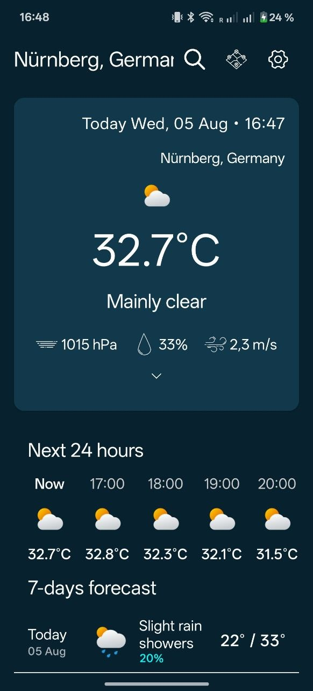
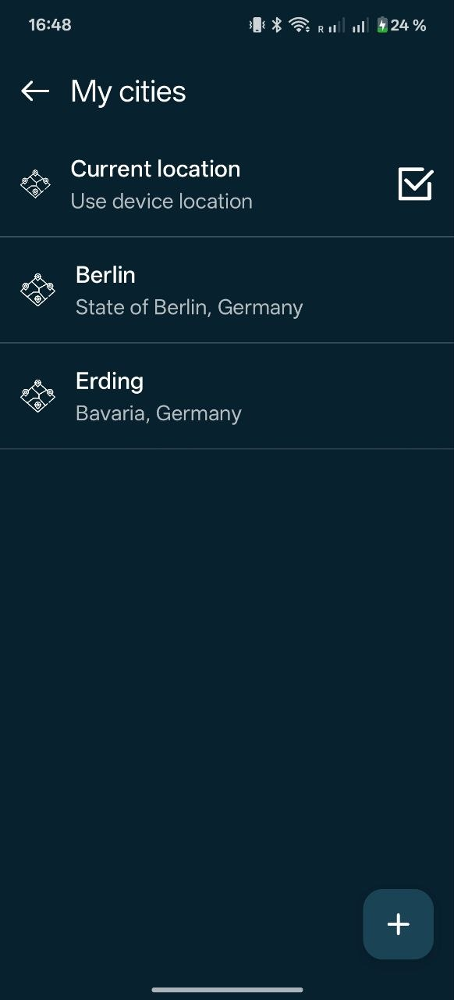
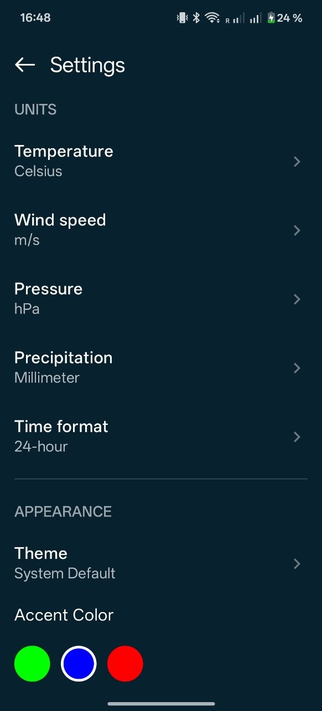
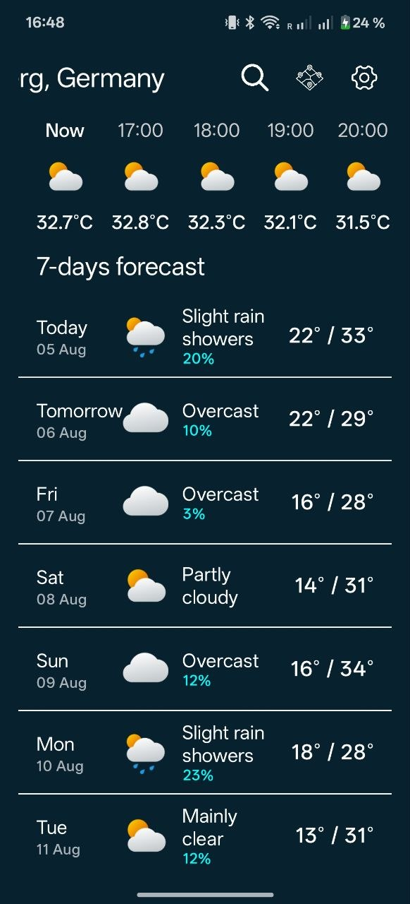

# WeatherApp


A modern, clean, and feature-rich weather application built with **Jetpack Compose**. This app provides real-time weather data, forecasts, and city management with a focus on smooth animations and a premium user experience.

## Screenshots

| Main Screen | City Search | Settings | 7-Day Forecast |
| :---: | :---: | :---: | :---: |
|  |  |  |  |

## ✨ Features

- **Real-time Weather**: Current temperature, weather conditions, humidity, wind speed, and pressure.
- **7-Day Forecast**: Long-term weather outlook.
- **City Management**: Search for any city globally and save your favorites for quick access.
- **Location Awareness**: Automatic weather detection based on your current GPS location.
- **Daily Notifications**: Smart background updates that notify you of the weather every morning at **7:00 AM** using **WorkManager**.
- **Highly Customizable**:
  - Toggle between Celsius and Fahrenheit.
  - Choose preferred units for Wind Speed, Pressure, and Precipitation.
  - Support for 12h/24h time formats.
  - **Theming**: Dark/Light mode support and custom accent colors.
- **Premium UX**:
  - **Spring Physics**: Smooth, elastic navigation transitions.
  - **Auto-Scrolling Title**: Long location names automatically scroll (Marquee) in the top bar.
  - **Pull-to-Refresh**: Easily sync the latest data and reset forecast timelines.

## Testing & CI/CD

- **Unit Testing**: Over **29 comprehensive unit tests** covering ViewModels, Use Cases, Mappers, and API parsing.
- **Automated CI**: Full **GitHub Actions** pipeline (`android-ci.yml`) that automatically checks code formatting (Spotless), runs all unit tests, and verifies the build on every push.
- **Mocking**: Robust test environment using **MockK** for dependency behavior and **MockWebServer** for network layer verification.

## Tech Stack

- **UI**: Jetpack Compose for a modern declarative UI.
- **Architecture**: Clean Architecture with MVVM + MVI pattern.
- **Dependency Injection**: Hilt + Hilt-Work for background injection.
- **Networking**: Retrofit + Moshi for API communication.
- **Background Tasks**: WorkManager for scheduled notifications.
- **Local Database**: Room for caching and storage.
- **Preferences**: DataStore for persistent settings.
- **Animations**: Compose Animation APIs with custom Spring physics.

## Project Structure

The project follows a strict package-by-feature organization within clean architecture layers:

```text
com.plcoding.weatherapp
├── data                # Data layer (Repositories, DTOs, DAOs, Mappers)
│   ├── local           # Room database and Local Data Sources
│   ├── remote          # Retrofit API interfaces and DTOs
│   └── repository      # Implementation of Domain Repositories
├── domain              # Domain layer (Models, Repository Interfaces, Use Cases)
│   ├── location        # Location-related entities
│   ├── repository      # Repository definitions
│   ├── usecase         # Business logic (Pure Kotlin Use Cases)
│   └── weather         # Weather domain models
├── presentation        # UI layer (Composables, ViewModels, State)
│   ├── ui.theme        # Color, Type, and Theme definitions
│   └── weather         # Weather feature screens and components
│       ├── current     # Current weather components
│       ├── hourly      # Hourly forecast components
│       ├── daily       # Daily forecast components
│       └── state       # MVI State and Actions
├── notification        # WorkManager Workers and Notification logic
└── di                  # Dependency Injection modules
```

## Getting Started

1. **Clone the repository**:
   ```bash
   git clone https://github.com/Trafi25/ComposeWeatherApp.git
   ```
2. **Open in Android Studio**:
   Import the project and wait for Gradle sync.
3. **Run**:
   Select an emulator or physical device and click **Run**.

---
*Built with ❤️ using Jetpack Compose.*
